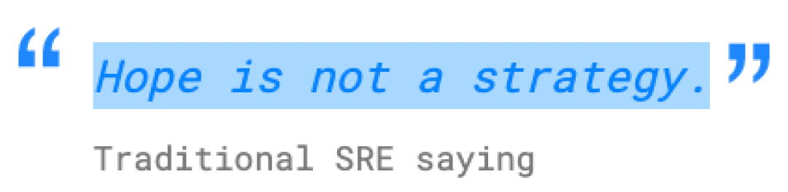

# FbM Template for AKS - CI/CD Best Practices

  

# QuickStart

View the [QuickStart](./QUICKSTART.md) guide for getting the example up and running locally.

# Logging/RequestId/NLog

Topics related to logging and correlationId/requestId - [Logging](./LOGGING.md)

# Tools

* [SonarQube](https://sonar.maerskdev.net/dashboard?id=fbm-template&branch=main)
* [BlackDuck](...)

# Observability

We have a repository dedicated exlusively for observability and alerts management:

* [fbm-observability](https://github.com/Maersk-Global/fbm-observability)

# GitHub Repository Settings

This section offers guidelines for configuring GitHub repository settings to enforce rules and restrictions, along with recommended best practices. View the [Repository Settings](./REPO_SETTINGS.md) guide for detailed information.

# Local Development Lifecycle

This section provides detailed insights into the local development lifecycle. View the [Local Development Lifecycle](./LOCAL_DEV.md) page for detailed information.

# CI
See the [Continuous Integration (CI)](./CI.md) page for detailed guide on how to configure tools such as code analysis and security threat analysis. This page also discusses quality gates and versioning strategies.

# CD

See the [Continuous Deployment (CD)](./CD.md) page for information on containerization and deployment techniques.
