## Repository Settings

### Pull Request

When merging pull requests, you can allow any combination of merge commits, squashing, or rebasing. You can enable any of these options as shown so that you can perform these actions. 

  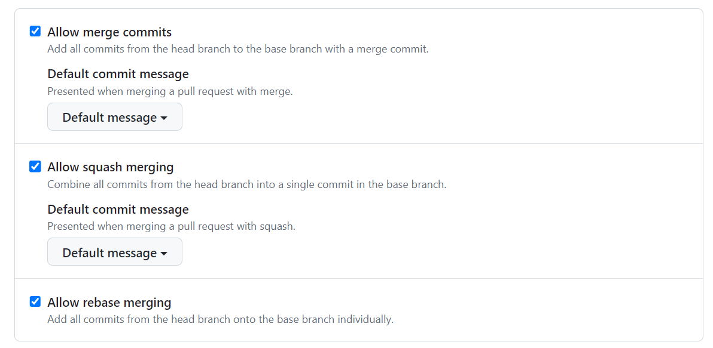

Control how and when users are prompted to update their branches if there are new changes available in the base branch.

  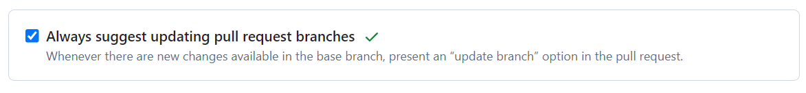

After pull requests are merged, you should have head branches deleted automatically.

  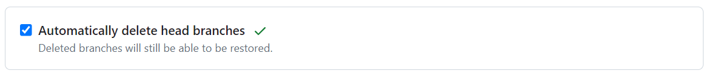

#### Github Body Pull request Template

Provides a template for describing the important salient reasons for the PR, confirming that proper testing was performed, design docs were written, screenshots are provided where necessary, etc.

__Example: [pull_request_template.md](.github/pull_request_template.md)__

More documentation from [Github](https://docs.github.com/en/communities/using-templates-to-encourage-useful-issues-and-pull-requests/creating-a-pull-request-template-for-your-repository)

### Branch Protection

Protecting a branch from unacceptable pull requests is the 1st line of defense. Not merging a branch when it doesn't meet the acceptable minimum requirements can be achieved by enabling branch protection.

These tasks require that the developer be an admin on the repository in question:

*Steps:*

Navigate to the repository, and click on Settings

Under code and automation on the left hand side, click on __Branches__

#### Branch Protection Rule for Main
Branch protection rules, if no available branch protection exists, click on __Add branch protection rule__
Branch name pattern type: main

  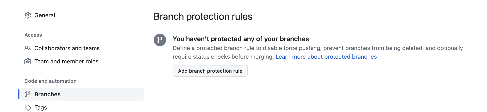

#### Approvers
Check the box for *Require a pull request before merging*
Check the box for *Require approvals*
Set the minimum number of approvers to (2)

  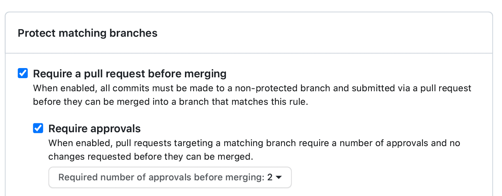

#### Require review from codeowners

Check the box for *Require review from Code Owners*
Ensure the box *Restrict who can dismiss pull request reviews* is unchecked
Ensure the box *Allow specified actors to bypass required pull requests* is unchecked
Check the box for *Require approval of the most recent reviewable push*

  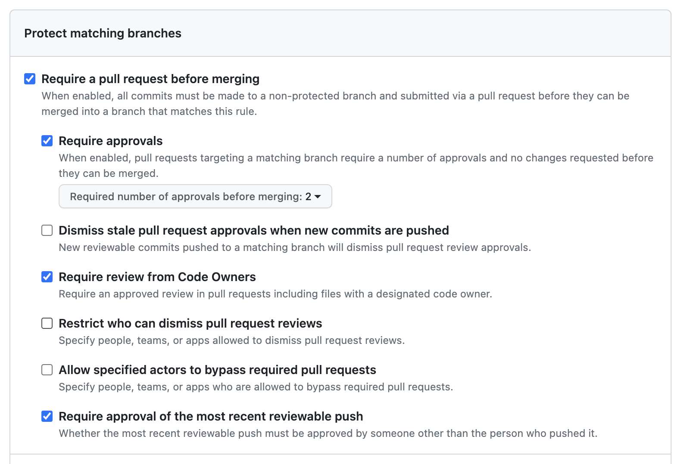

#### Verification Prior to Merge

In order to ensure the CI pipeline runs properly prior to merging the following settings should be enabled:

  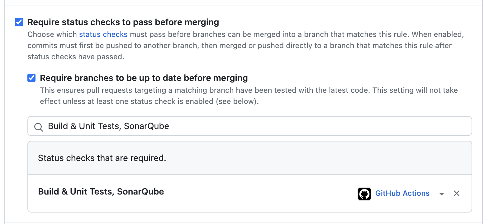

Check the box for *Require status checks to pass before merging*
Check the box for *Require branches to be up to date before merging*

In the search box below require branches to be up to date before merging, type in the search box: __Build & Unit Tests, SonarQube__

Click the item once found

#### Require conversation resolution

Check the box for *Require conversation resolution before merging*

  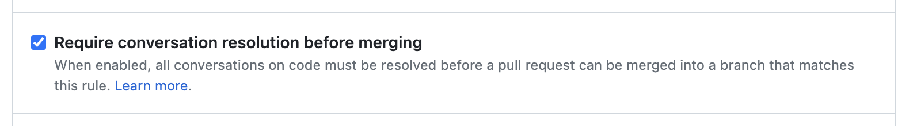

#### Configure deployment Environment

Check the box for *Require deployments to succeed before merging*

  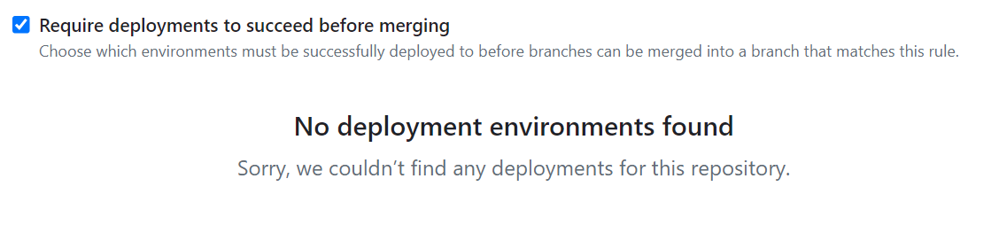

#### Ensure no-bypassing of settings

The rules apply to everyone, ensure the following is checked:

Check the box for *Do not allow bypassing the above settings*

  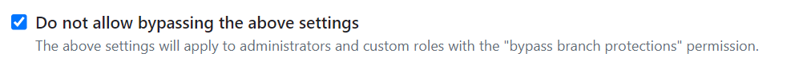

Under rules apply to everyone including administrators

Uncheck the box for *Allow force pushes* and *Allow deletions*

  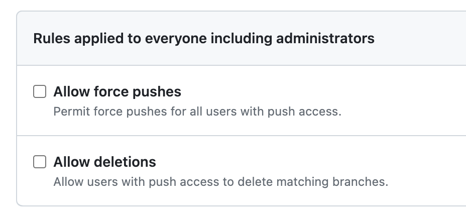

